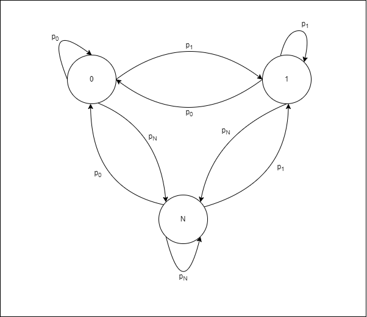
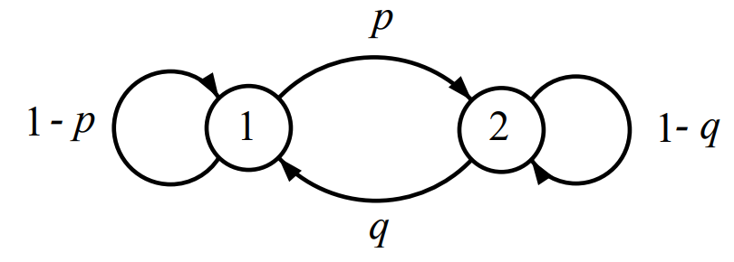
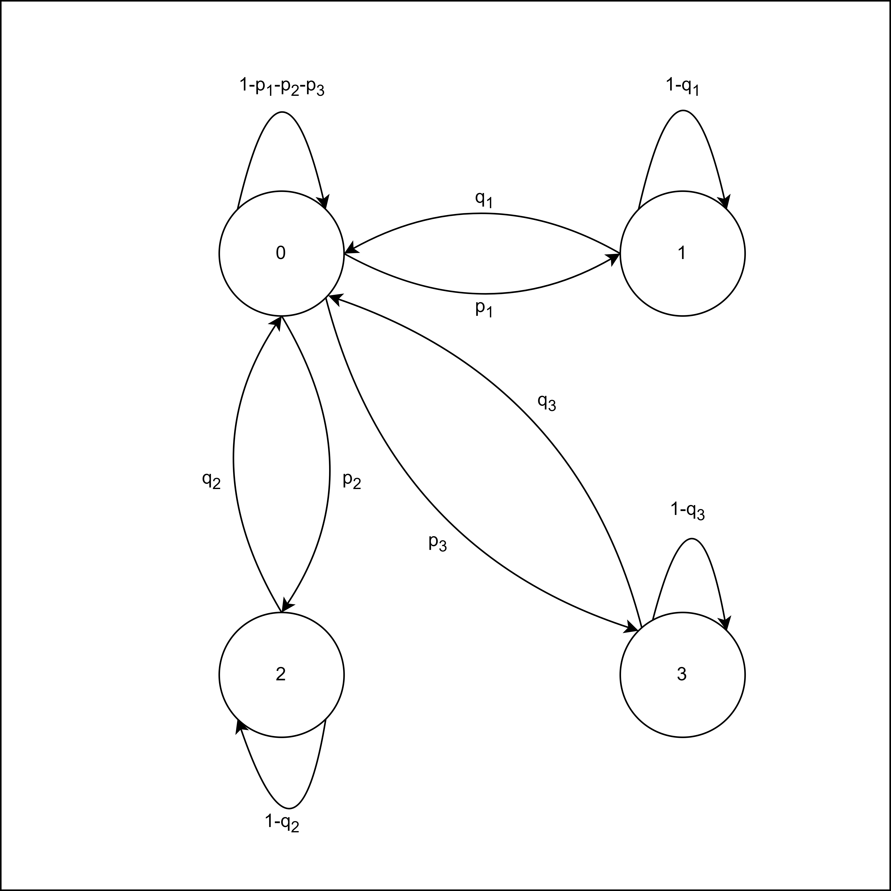
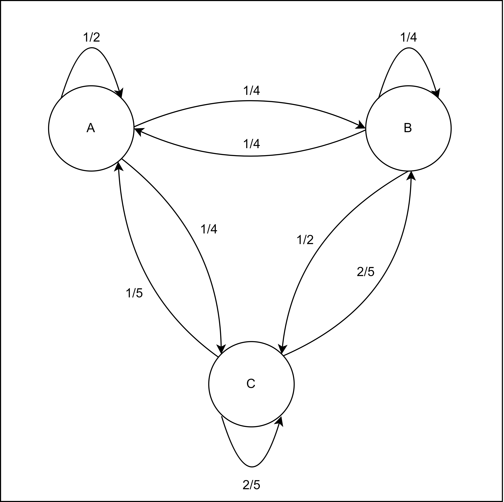
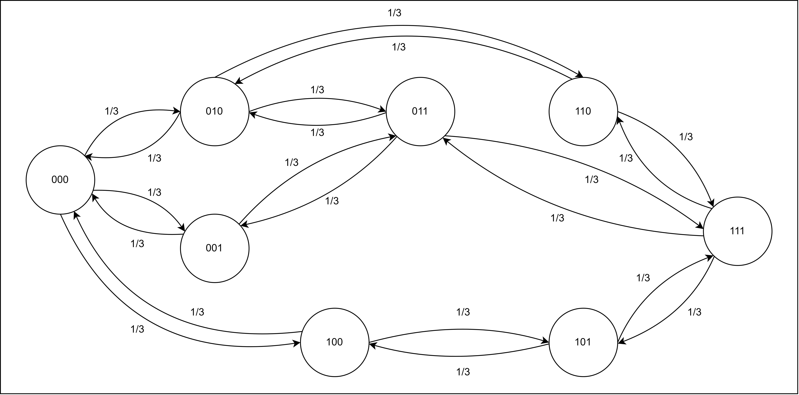
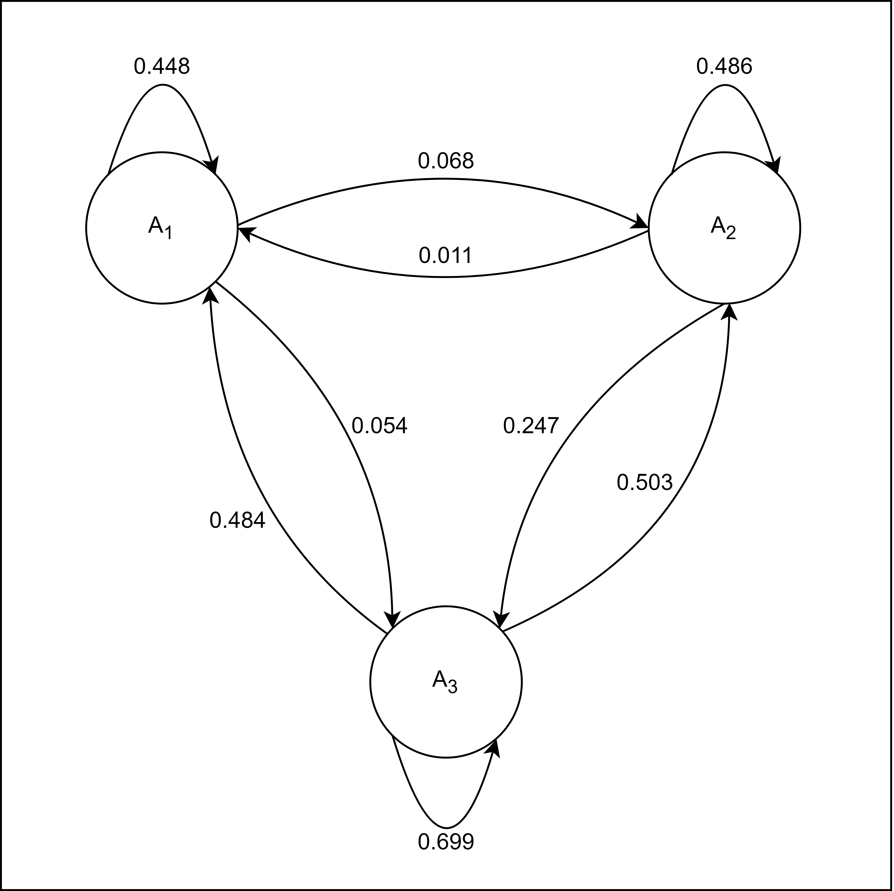

---
# Front matter
title: "Домашняя работа №1. Примеры 1-7"
subtitle: "Предмет: Теория случайных процессов"
author: "Александр Сергеевич Баклашов"

# Generic otions
lang: ru-RU
toc-title: "Содержание"

# Bibliography
bibliography: bib/cite.bib
csl: pandoc/csl/gost-r-7-0-5-2008-numeric.csl

# References settings
linkReferences: true
nameInLink: true

# Pdf output format

toc: true # Table of contents
toc_depth: 2
lof: true # List of figures
lot: false # List of tables
fontsize: 12pt
linestretch: 1.5
papersize: a4
documentclass: scrreprt
## I18n
polyglossia-lang:
  name: russian
  options:
	- spelling=modern
	- babelshorthands=true
polyglossia-otherlangs:
  name: english
### Fonts
mainfont: PT Serif
romanfont: PT Serif
sansfont: PT Sans
monofont: PT Mono
mainfontoptions: Ligatures=TeX
romanfontoptions: Ligatures=TeX
sansfontoptions: Ligatures=TeX,Scale=MatchLowercase
monofontoptions: Scale=MatchLowercase,Scale=0.9
## Biblatex
biblatex: true
biblio-style: "gost-numeric"
biblatexoptions:
  - parentracker=true
  - backend=biber
  - hyperref=auto
  - language=auto
  - autolang=other*
  - citestyle=gost-numeric
## Misc options
indent: true
header-includes:
  - \linepenalty=10 # the penalty added to the badness of each line within a paragraph (no associated penalty node) Increasing the value makes tex try to have fewer lines in the paragraph.
  - \interlinepenalty=0 # value of the penalty (node) added after each line of a paragraph.
  - \hyphenpenalty=50 # the penalty for line breaking at an automatically inserted hyphen
  - \exhyphenpenalty=50 # the penalty for line breaking at an explicit hyphen
  - \binoppenalty=700 # the penalty for breaking a line at a binary operator
  - \relpenalty=500 # the penalty for breaking a line at a relation
  - \clubpenalty=150 # extra penalty for breaking after first line of a paragraph
  - \widowpenalty=150 # extra penalty for breaking before last line of a paragraph
  - \displaywidowpenalty=50 # extra penalty for breaking before last line before a display math
  - \brokenpenalty=100 # extra penalty for page breaking after a hyphenated line
  - \predisplaypenalty=10000 # penalty for breaking before a display
  - \postdisplaypenalty=0 # penalty for breaking after a display
  - \floatingpenalty = 20000 # penalty for splitting an insertion (can only be split footnote in standard LaTeX)
  - \raggedbottom # or \flushbottom
  - \usepackage{float} # keep figures where there are in the text
  - \floatplacement{figure}{H} # keep figures where there are in the text
  - \usepackage{color}
---

# Цель работы

1)	Для каждого примера построить граф переходов.

2)	Дать содержательную трактовку следующих характеристик для каждого примера: 

-	Время непрерывного пребывания цепи в некотором множестве состояний и тесно связанной с ним времени достижения цепью некоторого состояния или множества состояний; 

-	Вероятность попадания процесса в фиксированное состояние или множество состояний после выхода из другого множества состояний; 

-	Доля времени, проведенного системой в том или ином состоянии или множестве состояний;

-	Время обрыва.

# Выполнение работы

## Пример 1

### Условие

Измерения различных величин (пробега автомобиля, дебита нефтяной или газовой скважины, расхода электроэнергии ) $X$ = {$X_n$, $n$ = 1, 2, . . . } за отдельные промежутки времени часто можно рассматривать как н.о.р. с.в. с конечным числом, скажем $N$, возможных значений, с вероятностями

$$P\{X_n = k\} = p_k, \,\,\,\, k = 0, . . . , N$$

${X_n}$ можно рассматривать также как МЦ с $E$ = \{$0$, $1$, ... , $N$\}, пер. вер. $p_{ij}$ = $p_j$, $i$, $j$ $\in$ $E$, и МВП

$$P =\begin{bmatrix}
p_0& ... & p_N \\
p_0& ... & p_N \\
&...
\end{bmatrix}$$

При этом совпадение строк матрицы указывает на независимость с.в. $X_n$.

### Решение

#### Граф

{ #fig:001 width=80% }

#### Характеристики

-	Время непрерывного пребывания цепи в некотором множестве состояний и тесно связанной с ним времени достижения цепью некоторого состояния или множества состояний:

В данном контексте "время непрерывного пребывания" может быть интерпретировано как длительность времени, в течение которой цепь Маркова находится в определенном множестве состояний, прежде чем перейти в другое состояние. Например, если мы имеем цепь Маркова, описывающую работу автомобиля, и множество состояний представляет собой состояния автомобиля (усиленный режим работы, сбалансированный режим работы, слабый режим работы, неисправен), то время непрерывного пребывания в множестве состояний "усиленный режим работы" будет интерпретироваться как время, в течение которого автомобиль эксплуатировался в усиленном режиме работы.

Время достижения состояния означает время, которое требуется цепи Маркова, чтобы перейти из одного состояния в другое. 

Например, это может быть время, которое требуется для того, чтобы автомобиль перешел "сломался" (перешел в состояние "неисправен") после продолжительной работы в усиленном режиме.

-	Вероятность попадания процесса в фиксированное состояние или множество состояний после выхода из другого множества состояний:

Эта вероятность описывает вероятность того, что цепь Маркова окажется в определенном состоянии после того, как она вышла из другого множества состояний. Например, если мы рассматриваем горные породы, то это может быть вероятность того, что одна порода сменилась другой после того, как высота вышла из некоторого другого диапазона значений.

В случае с автомобилем $-$ это вероятность того, что, например, после выхода из состояния "усиленный режим работы", автомобиль попадёт в состояние "слабый режим работы". 

-	Доля времени, проведенного системой в том или ином состоянии или множестве состояний;

Эта характеристика описывает, сколько времени система проводит в каждом из состояний или множеств состояний. Например, если мы рассматриваем тот же случай с автомобилем, то это может быть доля времени, в течение которой автомобиль эксплуатировался в усиленном режиме.

-	Время обрыва.

Время обрыва описывает длительность времени, в течение которой система находится в нерабочем состоянии или не функционирует. Например, в контексте автомобиля это может быть время, в течение которого автомобиль находится в ремонте или не подходит для использования. Время обрыва важно для оценки надежности и доступности системы.

- Стационарные вероятности:

При N = 1 МВП равно:

$$P =\begin{bmatrix} 
p_0 & p_1 \\
p_0 & p_1 \\
\end{bmatrix}$$

Стац. вер-ти будут вычисляться из СЛУ:

$$
\begin{cases} 
p_0^2+p_0p_1 = p_0\\
p_0+p_1=1\\
\end{cases}
$$

## Пример 2

### Условие

Если рассматривать накопленные за $n$ дней измерения: $S_n$ = $X_n$ + · · · + $X_n$, то множество значений этих величин не ограничено. Тем не менее, последовательность $S_n$ образует цепь Маркова с переходными вероятностями

$$
\begin{cases} 
p_{j-i}, \ если \ j ≥i  \\
0,   если \ j<i
\end{cases}
$$

Ее матрица вероятностей перехода может быть представлена бесконечной вниз и вправо таблицей, но чтобы не выходить за рамки конечных моделей, рассматриваемых в настоящем разделе, будем считать, что по достижении некоторого состояния, скажем M, процесс возвращается в состояние 0.
Применительно к пробегу автомобиля это означает, что фактически наблюдается не пробег автомобиля, а показания спидометра, которые “обнуляются” по достижении пробега в $M$ = $100000$ км.

МВП размерности M × M для такой цепи имеет вид:

$$
P=
\begin{bmatrix}
p_0 & p_1 & p_2 & \ldots & p_{M-1} & p_M \\
0 & p_0 & p_1 & \ldots & p_{M-2} & p_{M-1} \\
0 & 0 & p_0 & \ldots & p_{M-3} & p_{M-2} \\
\vdots & \vdots & \vdots & \ddots & \vdots & \vdots \\
0 & 0 & 0 & \ldots & p_0 & p_1 \\
1 & 0 & 0 & \ldots & 0 & 0 \\
\end{bmatrix}$$

### Решение

#### Граф

{ #fig:002 width=90% }

#### Характеристики

-	Время непрерывного пребывания цепи в некотором множестве состояний и тесно связанной с ним времени достижения цепью некоторого состояния или множества состояний:

В данной цепи Маркова "время непрерывного пребывания" может быть интерпретировано как длительность времени, в течение которой система находится в некотором заданном состоянии (например, текущий пробег автомобиля) до того, как перейдет в другое состояние.

Время достижения цепью некоторого состояния будет означать длительность времени, которая требуется системе для достижения определенного пробега автомобиля.

-	Вероятность попадания процесса в фиксированное состояние или множество состояний после выхода из другого множества состояний:

Эта характеристика описывает вероятность того, что после того, как система достигла определенного пробега (или состояния), она снова "обнулится" и начнет отсчитывать пробег с начала (с 0 км.).

Вероятность того, что система попадет в фиксированное состояние (например, пробег M), после того как достигла другого состояния (например, 0), означает вероятность перехода между этими состояниями.

В контексте автомобильного пробега это может быть вероятностью того, что автомобиль достигнет пробега 100000 км после того, как начал движение с 0 км (при том, что максимальное кол-во километров на одометре - 99999).

-	Доля времени, проведенного системой в том или ином состоянии или множестве состояний:

Эта характеристика описывает, какую часть времени система проводит в различных состояниях или пробегах. Например, доля времени, проведенная автомобилем на определенном пробеге, может быть вычислена как отношение времени, проведенного на этом пробеге, к общему времени работы автомобиля.

-	Время обрыва:

Время обрыва описывает длительность времени, в течение которой система находится в нерабочем состоянии или не функционирует. Например, в контексте пробега автомобиля это может быть время, в течение которого одометр неисправен.

## Пример 3 $-$ Надёжность

### Условие

Рассмотрим техническое устройство, которое может находиться в двух состояниях: исправном – 0 и неисправном – 1. Наблюдения за процессом функционирования устройства в дискретные моменты времени с фиксированным интервалом времени можно описать последовательностью, принимающей два значения.

Предположим, что переход из исправного состояния в неисправное происходит с вероятностью p независимо от предыдущей истории, а с дополнительной вероятностью 1 − p также независимо от предыдущей истории устройство остается в исправном состоянии в течение следующей единицы времени.

Аналогично этому предположим, что с вероятностями q и 1 − q за единицу времени происходит восстановление неисправного устройства или продолжается его ремонт также независимо от его предыдущей истории.

Тогда процесс функционирования устройства описывается марковской цепью
с переходной матрицей:

$$P =
\begin{bmatrix}
1-p & p \\
q & 1-q \\
\end{bmatrix}$$

#### Граф

{ #fig:003 width=90% }

### Решение

#### Характеристики

-	Время непрерывного пребывания цепи в некотором множестве состояний и тесно связанной с ним времени достижения цепью некоторого состояния или множества состояний:

В данной марковской цепи "время непрерывного пребывания" означает, как долго устройство остается в определенном состоянии (например, исправном или неисправном), прежде чем перейти в другое состояние. 

"Время достижения" относится к периоду времени, который требуется устройству, чтобы перейти из одного состояния в другое.

Например, время непрерывного пребывания в исправном состоянии может быть равно времени, в течение которого устройство остается исправным, а время достижения будет означать время, которое устройству требуется, чтобы перейти из исправного состояния в неисправное или обратно.

-	Вероятность попадания процесса в фиксированное состояние или множество состояний после выхода из другого множества состояний:

Эта характеристика описывает вероятность того, что устройство перейдет в определенное состояние (например, станет исправным или неисправным) после того, как находилось в другом состоянии.

Например, вероятность перехода из неисправного состояния в исправное состояние (восстановление) определяется вероятностью q, а вероятность остаться неисправным определяется вероятностью 1 - q. Аналогично, вероятность перехода из исправного состояния в неисправное состояние (отказ) определяется вероятностью p, а вероятность остаться исправным определяется вероятностью 1 - p.

-	Доля времени, проведенного системой в том или ином состоянии или множестве состояний:

Эта характеристика описывает, сколько времени система проводит в каждом из состояний (например, исправном или неисправном).

-	Время обрыва:

Время обрыва не определено, т.к. матрица стохастическая.

- Стационарные вероятности:

$$\begin{cases} 
p_0-pp_0+p_1q=p_0\\
p_0+p_1=1\\
\end{cases}
$$

$$
\begin{cases} 
-pp_0+p_1q=0\\
p_0=1-p_1\\
\end{cases}
$$

$$
\begin{cases} 
-p+pp_1+p_1q=0\\
p_0=1-p_1\\
\end{cases}
$$

$$
\begin{cases} 
p_1=\frac{p}{p+q}\\
p_0=1-p_1\\
\end{cases}
$$

## Пример 4 $-$ Отказы нескольких типов

### Условие

Обобщим предыдущий пример, рассмотрим отказы различных агрегатов. Тогда можно расширить пространство состояний, допуская несколько типов неисправностей системы. Заметим, что исправное состояние тоже можно расширить, вводя различного вида предотказовые состояния, позволяющие
контролировать систему и управлять ее работой.

Впрочем, конкретное описание системы относится скорее к области искусства моделирования, чем к изучению марковских цепей.

Пусть имеется, например, всего три типа отказов, которые происходят независимо от предыдущего поведения системы, а только от текущего её состояния. Обозначим через $p_i$, $i$ = $1, 2, 3$ вероятность возникновения отказа $i$-го типа и через $q_i$ — вероятность восстановления такого отказа за единицу времени.

Предположим дополнительно, что два отказа не могут возникнуть одновременно, и во время ремонта не может возникнуть отказ другого типа.

### Решение

#### Матрица вероятностей переходов (МВП)

$$
P =
\begin{bmatrix}
1-p_1-p_2-p_3 & p_1 & p_2 & p_3 \\
q_1 & 1-q_1 & 0 & 0 \\
q_2 & 0 & 1-q_2 & 0 \\
q_3 & 0 & 0 & 1-q_3 \\
\end{bmatrix}
$$

#### Граф

{ #fig:004 width=70% }

#### Характеристики

-	Время непрерывного пребывания цепи в некотором множестве состояний и тесно связанной с ним времени достижения цепью некоторого состояния или множества состояний:

Эта характеристика относится к времени, которое система проводит в определенном состоянии или множестве состояний подряд, без переходов в другие состояния. Например, если система находится в исправном состоянии (0) и остается в этом состоянии в течение времени без переходов в состояния отказов, это будет время непрерывного пребывания в исправном состоянии.

Временем достижения можем считать время восстановления после определённого типа отказа.

-	Вероятность попадания процесса в фиксированное состояние или множество состояний после выхода из другого множества состояний:

Эта характеристика относится к вероятности того, что система окажется в определенном состоянии или множестве состояний после завершения другой последовательности состояний.

Например, вероятность того, что система вернется в исправное состояние после нахождения в множестве состояний отказа.

-	Доля времени, проведенного системой в том или ином состоянии или множестве состояний:

Эта характеристика позволяет определить, сколько времени система проводит в каждом из состояний или множеств состояний в сравнении с общим временем функционирования системы.

Например, в состоянии множества отказов или в исправном состоянии в сравнении с общим временем функционирования системы.

-	Время обрыва:

Время обрыва не определено, т.к. матрица стохастическая.

- Стационарные вероятности:

$$
\begin{cases} 
p_0(1-p_1-p_2-p_3) + p_1q_1 + p_2q_2 + p_3q_3 = p_0 \\
p_0p_1 + p_1(1-q_1) = p_1 \\
p_0p_2 + p_2(1-q_2) = p_2 \\
p_0+p_1+p_2+p_3=1 \\
\end{cases}
$$

## Пример 5 $-$ Стратиграфия

### Условие

При стратиграфических исследованиях пород наблюдения проводятся через
определенные фиксированные интервалы, например, через $0.5$ м. вдоль
разреза. При этом состояниями являются типы наблюдаемых пород. Если $A$
означает песчаник, $B$ — известняк и $C$ — сланец, то последовательность
наблюдений вдоль разреза может иметь вид:

$$
AAABBCBCACCCBA.
$$

В этой модели аргументом является расстояние, а “время пребывания” в
состоянии определяет толщину пласта, измеренную в дискретных единицах.

Предположим, что статистика позволяет прийти к выводу о независимости
следования пород в разрезе от предыдущих наблюдений при фиксированном
типе наблюдаемой породы. Тогда изучаемое явление может быть описано
марковской цепью с числом состояний, равным числу типов пород.

Обозначая состояния разреза теми же буквами, что и породы:
$E = \{A, B, C, . . . \}$ в качестве упражнения предлагается истолковать
приведённые наблюдения, выписать МВП и нарисовать граф переходов
марковской цепи для приведенного примера.

### Решение

#### Толкование

Для данной задачи описания стратиграфических исследований, можно создать марковскую цепь, где состояниями будут типы пород (A, B, C) и анализировать последовательность наблюдений (AAABBCBCACCCBA) в виде марковского процесса.

A->A->A->B->B->C->B->C->A->C->C->C->B->A

Множество состояний (E) состоит из трех типов пород: E = {A, B, C}.

Для данного примера, где наблюдения проводятся через фиксированные интервалы, можно предположить, что состояния марковской цепи изменяются с определенной вероятностью при каждом измерении. Давайте определим переходные вероятности между этими состояниями, на основе данной последовательности наблюдений:

Вероятность перехода из A в A: p(A -> A) = 1/2 (A->A->A->B->B->C->B->C->A->C->C->C->B->A)

Вероятность перехода из A в B: p(A -> B) = 1/4 (A->A->A->B->B->C->B->C->A->C->C->C->B->A)

Вероятность перехода из A в C: p(A -> C) = 1/4 (A->A->A->B->B->C->B->C->A->C->C->C->B->A)

Вероятность перехода из B в A: p(B -> A) = 1/4 (A->A->A->B->B->C->B->C->A->C->C->C->B->A)

Вероятность перехода из B в B: p(B -> B) = 1/4 (A->A->A->B->B->C->B->C->A->C->C->C->B->A)

Вероятность перехода из B в C: p(B -> C) = 1/2 (A->A->A->B->B->C->B->C->A->C->C->C->B->A)

Вероятность перехода из C в A: p(C -> A) = 1/5 (A->A->A->B->B->C->B->C->A->C->C->C->B->A)

Вероятность перехода из C в B: p(C -> B) = 2/5 (A->A->A->B->B->C->B->C->A->C->C->C->B->A)

Вероятность перехода из C в C: p(C -> C) = 2/5 (A->A->A->B->B->C->B->C->A->C->C->C->B->A)

#### Матрица вероятностей переходов (МВП)

После вычисления переходных вероятностей, мы можем построить матрицу вероятностей переходов (МВП):

$$
P =
\begin{bmatrix}
\frac{1}{2} & \frac{1}{4} & \frac{1}{4}  \\
\\
\frac{1}{4} & \frac{1}{4} & \frac{1}{2} \\
\\
\frac{1}{5} & \frac{2}{5} & \frac{2}{5}\\
\end{bmatrix}
$$

#### Граф

{ #fig:005 width=90% }

#### Характеристики

-	Время непрерывного пребывания цепи в некотором множестве состояний и тесно связанной с ним времени достижения цепью некоторого состояния или множества состояний:

Эта характеристика относится к времени, которое система проводит в определенном состоянии или множестве состояний подряд, без переходов в другие состояния. 

Например, если исследование показало тип породы A, то время непрерывного пребывания в состоянии A можно интерпретировать как толщину пласта A, измеренную в дискретных единицах.

Временем достижения можем считать время перехода от одной породе к другой.

-	Вероятность попадания процесса в фиксированное состояние или множество состояний после выхода из другого множества состояний:

Эта характеристика относится к вероятности того, что система окажется в определенном состоянии или множестве состояний после завершения другой последовательности состояний.

Например, вероятность того, что что за одной породой (напр., A) будет следовать другая (напр., B).

-	Доля времени, проведенного системой в том или ином состоянии или множестве состояний:

Эта характеристика позволяет определить, сколько времени система проводит в каждом из состояний или множеств состояний в сравнении с общим временем функционирования системы.

В данном случае может описываться как общая непрерывная толщина какой-либо породы.

-	Время обрыва:

Время обрыва не определено, т.к. матрица стохастическая.

- Стационарные вероятности:

$$\begin{cases} 
0.5*A+0.25*B+0.2*C=A \\
0.25*A+0.25*B+0.4*C=B \\
A+B+C=1 \\
\end{cases}
$$

$$\begin{cases} 
0.25*B+0.2*C=0.5*A \\
0.25*A+0.4*C=0.75*B \\
A+B+C=1 \\
\end{cases}
$$

$$\begin{cases} 
A=4/13 \\
B=4/13 \\
C=5/13 \\
\end{cases}
$$

## Пример 6 $-$ Модель Эренфеста для диффузии

### Условие

В сосуде, разделенном на две части A и B находится газ.

В дискретные моменты времени одна из молекул перемещается из той части, где она находилась в другую.

Рассмотрим для простоты случай трех молекул.

Обозначим $x = \{x_1, x_2, x_3\}$ состояние, при котором где $x_i$ = 1, если $i$-я молекула находится в области $A$, и $x_i$ = 0 в противоположном случае. МВП:

$$
P =
\begin{bmatrix}
0 & \frac{1}{3} & \frac{1}{3} & \frac{1}{3} & 0 & 0 & 0 & 0 \\
\\
\frac{1}{3} & 0 & 0 & 0 & \frac{1}{3} & \frac{1}{3} & 0 & 0 \\
\\
\frac{1}{3} & 0 & 0 & 0 & \frac{1}{3} & 0 & \frac{1}{3} & 0 \\
\\
\frac{1}{3} & 0 & 0 & 0 & 0 & \frac{1}{3} & \frac{1}{3} & 0 \\
\\
0 & \frac{1}{3} & \frac{1}{3} & 0 & 0 & 0 & 0 & \frac{1}{3} \\
\\
0 & \frac{1}{3} & 0 & \frac{1}{3} & 0 & 0 & 0 & \frac{1}{3} \\
\\
0 & 0 & \frac{1}{3} & \frac{1}{3} & 0 & 0 & 0 & \frac{1}{3} \\
\\
0 & 0 & 0 & 0 & \frac{1}{3} & \frac{1}{3} & \frac{1}{3} & 0 \\
\end{bmatrix}
$$

### Решение

#### Граф

{ #fig:006 width=90% }

#### Характеристики

-	Время непрерывного пребывания цепи в некотором множестве состояний и тесно связанной с ним времени достижения цепью некоторого состояния или множества состояний:

Эта характеристика относится к времени, которое система проводит в определенном состоянии или множестве состояний подряд, без переходов в другие состояния. 

В контексте сосуда, данная характеристика показывает время, в течение которого молекула остается в определенной части сосуда (например, в части A).

Временем достижения можем считать время перехода от одной из части A в часть B и наоборот.

-	Вероятность попадания процесса в фиксированное состояние или множество состояний после выхода из другого множества состояний:

Эта характеристика относится к вероятности того, что система окажется в определенном состоянии или множестве состояний после завершения другой последовательности состояний.

Например, вероятность того, что система перейдёт из части A в часть B и наоборот.

-	Доля времени, проведенного системой в том или ином состоянии или множестве состояний:

Эта характеристика позволяет определить, сколько времени система проводит в каждом из состояний или множеств состояний в сравнении с общим временем функционирования системы.

Например, время пребывания газа в части A или в части B.

-	Время обрыва:

Время обрыва не определено, т.к. матрица стохастическая.

- Стационарные вероятности:

$$\begin{cases} 
\frac{1}{3}*P_2+\frac{1}{3}*P_3+\frac{1}{3}*P_4=P_1 \\
\frac{1}{3}*P_1+\frac{1}{3}*P_5+\frac{1}{3}*P_6=P_2 \\
\frac{1}{3}*P_1+\frac{1}{3}*P_5+\frac{1}{3}*P_7=P_3 \\
\frac{1}{3}*P_1+\frac{1}{3}*P_6+\frac{1}{3}*P_7=P_4 \\
\frac{1}{3}*P_2+\frac{1}{3}*P_3+\frac{1}{3}*P_8=P_5 \\
\frac{1}{3}*P_2+\frac{1}{3}*P_4+\frac{1}{3}*P_8=P_6 \\
\frac{1}{3}*P_3+\frac{1}{3}*P_4+\frac{1}{3}*P_8=P_7 \\
P_1+P_2+P_3+P_4+P_5+P_6+P_7+P_8=1 \\
\end{cases}
$$

Т.к. МВП симметрична относительно главной диагонали, получаем:

$$\begin{cases} 
P_1 = \frac{1}{8} \\
P_2= \frac{1}{8} \\
P_3= \frac{1}{8} \\
P_4= \frac{1}{8} \\
P_5= \frac{1}{8} \\
P_6= \frac{1}{8} \\
P_7= \frac{1}{8} \\
P_8= \frac{1}{8} \\
\end{cases}
$$

## Пример 7 $-$ Распределение населения по группам профессий.

### Условие

Пусть $\{A_1, A_2, A_3\}$ —множество типов профессий. Сын может выбрать любой
тип профессии, однако этот выбор зависит от профессии отца. Следующая
таблица составлена по данным одного из социологических исследований,
проведенных в Англии и Уэльсе. В ней показана доля детей, выбравших тот
или иной вид занятости в зависимости от типа профессии отца.

$$
\begin{bmatrix}
0.448 & 0.484 & 0.068 \\
0.054 & 0.699 & 0.247 \\
0.011 & 0.503 & 0.486 \\
\end{bmatrix}
$$

Пусть $X_n$ — вид занятости, избранный представителем $n$-го поколения семьи.
Тогда МВП совпадает с таблицей, приведенной ранее. В качестве
упражнения 6 предлагается нарисовать соответствующий граф переходов.
В дальнейшем будет показано, как по этим данным сделать прогноз
распределения населения по группам профессий.

### Решение

#### Граф

{ #fig:007 width=90% }

#### Характеристики

-	Время непрерывного пребывания цепи в некотором множестве состояний и тесно связанной с ним времени достижения цепью некоторого состояния или множества состояний:

Эта характеристика относится к времени, которое система проводит в определенном состоянии или множестве состояний подряд, без переходов в другие состояния. 

В контексте выбора профессии, данная характеристика показывает время, в течение которого сыновья выбирают профессию отца.

Временем достижения можем считать число поколений, после которого цепочка прервётся и сын выберет другую профессию, нежели профессию отца.

-	Вероятность попадания процесса в фиксированное состояние или множество состояний после выхода из другого множества состояний:

Эта характеристика относится к вероятности того, что система окажется в определенном состоянии или множестве состояний после завершения другой последовательности состояний.

Например, вероятность того, что сын выберет профессию, отличную от профессию отца, при том, что до этого его отец выбрал профессию отца (деда сына).

-	Доля времени, проведенного системой в том или ином состоянии или множестве состояний:

Эта характеристика позволяет определить, сколько времени система проводит в каждом из состояний или множеств состояний в сравнении с общим временем функционирования системы.

Например, время выбора сыновьями определённой семьи профессий своих отцов.

-	Время обрыва:

Время обрыва не определено, т.к. матрица стохастическая.

- Стационарные вероятности:

$$
\begin{cases} 
0.448*A_1+0.054*A_2+0.011*A_3=A_1 \\
0.484*A_1+0.699*A_2+0.503*A_3=A_2 \\
A_1+A_2+A_3=1 \\
\end{cases}
$$

$$
\begin{cases} 
A_1 ≈ 0.067 \\
A_2 ≈ 0.624 \\
A_3 ≈ 0.309 \\
\end{cases}
$$

$$\frac{dS}{dt}=\begin{cases} 
-\alpha S, если \ I(t)>I^*\\
0, если \ I(t)⩽I^*\\
\end{cases}
$$