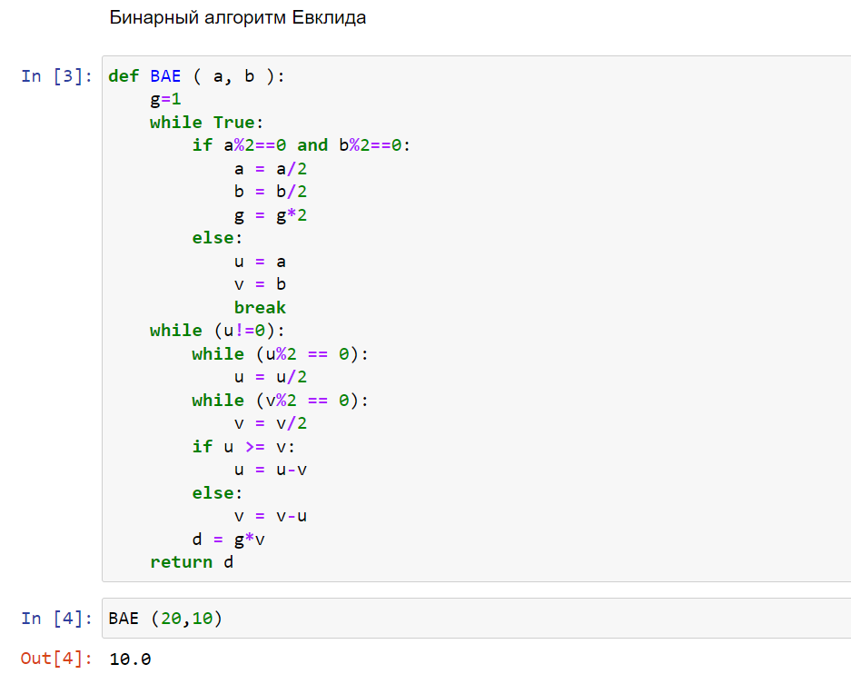
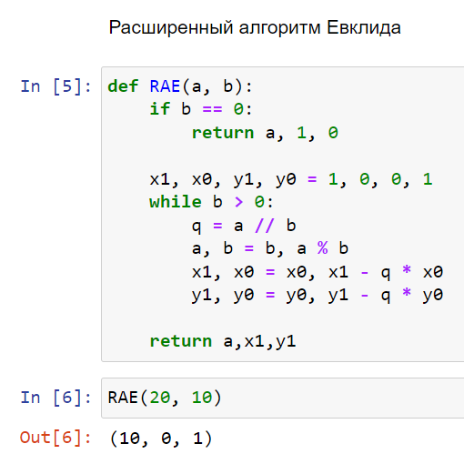
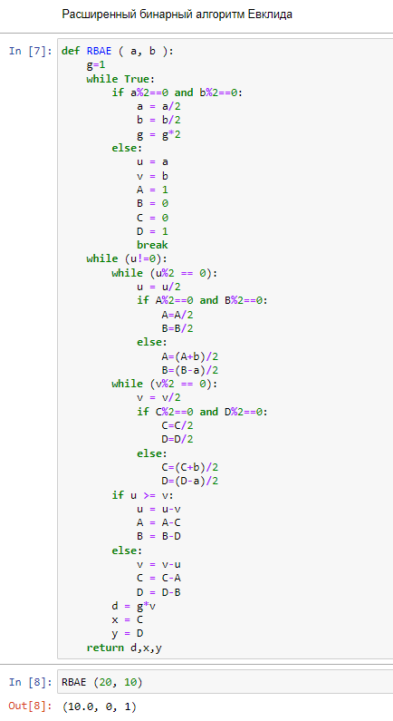

---
# Front matter
title: 'Реферат по статье "Система обслуживания с ветвящимися потоками вторичных требований."'
subtitle: "Предмет: Теория случайных процессов"
author: "Александр Сергеевич Баклашов"

# Generic otions
lang: ru-RU
toc-title: "Содержание"

# Bibliography
bibliography: bib/cite.bib
csl: pandoc/csl/gost-r-7-0-5-2008-numeric.csl

# References settings
linkReferences: true
nameInLink: true

# Pdf output format
toc: true # Table of contents
toc_depth: 2
lof: true # List of figures
lot: false # List of tables
fontsize: 12pt
linestretch: 1.25
papersize: a4
documentclass: scrreprt
## I18n
polyglossia-lang:
  name: russian
  options:
	- spelling=modern
	- babelshorthands=true
polyglossia-otherlangs:
  name: english
### Fonts
mainfont: PT Serif
romanfont: PT Serif
sansfont: PT Sans
monofont: PT Mono
mainfontoptions: Ligatures=TeX
romanfontoptions: Ligatures=TeX
sansfontoptions: Ligatures=TeX,Scale=MatchLowercase
monofontoptions: Scale=MatchLowercase,Scale=0.9
## Biblatex
biblatex: true
biblio-style: "gost-numeric"
biblatexoptions:
  - parentracker=true
  - backend=biber
  - hyperref=auto
  - language=auto
  - autolang=other*
  - citestyle=gost-numeric
## Misc options
indent: true
header-includes:
  - \linepenalty=10 # the penalty added to the badness of each line within a paragraph (no associated penalty node) Increasing the value makes tex try to have fewer lines in the paragraph.
  - \interlinepenalty=0 # value of the penalty (node) added after each line of a paragraph.
  - \hyphenpenalty=50 # the penalty for line breaking at an automatically inserted hyphen
  - \exhyphenpenalty=50 # the penalty for line breaking at an explicit hyphen
  - \binoppenalty=700 # the penalty for breaking a line at a binary operator
  - \relpenalty=500 # the penalty for breaking a line at a relation
  - \clubpenalty=150 # extra penalty for breaking after first line of a paragraph
  - \widowpenalty=150 # extra penalty for breaking before last line of a paragraph
  - \displaywidowpenalty=50 # extra penalty for breaking before last line before a display math
  - \brokenpenalty=100 # extra penalty for page breaking after a hyphenated line
  - \predisplaypenalty=10000 # penalty for breaking before a display
  - \postdisplaypenalty=0 # penalty for breaking after a display
  - \floatingpenalty = 20000 # penalty for splitting an insertion (can only be split footnote in standard LaTeX)
  - \raggedbottom # or \flushbottom
  - \usepackage{float} # keep figures where there are in the text
  - \floatplacement{figure}{H} # keep figures where there are in the text
---

# Введение

При проектировании различных систем $-$ от автоматических систем управления (АСУ) до вычислительных систем, значительную роль играют приоритетные модели теории массового обслуживания. Среди таких систем можно выделить системы с различными динамическими ориентациями и режимами переключения, которые выделяются в контексте исследования моделей, включающих в себя несколько типов требований. В таких моделях разнообразие типов требований подразумевает необходимость применения соответствующих системных ориентаций и режимов переключения при их изменении. 

Помимо этого, в рассматриваемых системах стоит задача оптимизации приоритетного обслуживания, заключающаяся в разработке оптимальных стратегий обслуживания, которые могли бы обеспечить эффективное управление различными типами требований в системе.

В данной работе рассматривается задача определения оптимальной дисциплины обслуживания в системе с несколькими типами требований, имеющих различные приоритеты и поступающих как извне (первичных), так и в результате обслуживания (вторичных) и ветвящимися потоком вторичных требований. Модели такого типа становятся актуальными при исследовании работы ЭВМ в различных режимах, исследовании информационно-поисковых и других различных систем.

Приведем конкретные примеры, где такие системы становятся значимыми. Предположим, мы рассматриваем работу компьютера в пакетном режиме. В этом случае после начальной обработки пакета данных определяется количество программ в нем. Каждая программа может запросить разнообразные ресурсы, такие как вызов стандартных программ, доступ к оперативной памяти, или обращение к внешним устройствам для получения дополнительной информации.

Еще один пример связан с задачей поиска информации в массивах данных. После анализа некоторого массива можно обнаружить, что необходимая информация на самом деле содержится в одном из других массивов.

Эти примеры демонстрируют, насколько важным является эффективное управление разнообразными запросами и ресурсами в системах с ветвящимися потоками требований, исследование и оптимизация которых имеют непосредственное прикладное значение. Организация работы таких систем также включает оперативное определение приоритетов обслуживания требований. Данная работа демонстрирует, что относительно линейного функционала потерь оптимальной является именно приоритетная дисциплина, для которой приводится алгоритм её построения.

# Постановка задачи. Предположения

В работе "Система обслуживания с ветвящимися потоками вторичных требований" рассматривается однолинейная система обслуживания (система обслуживания (СО), в которой все поступающие заявки хранятся в одной очереди), выполняющая $r$ типов операций. Длительности выполнения отдельных операций являются независимыми случайными величинами (СВ) с функциями распределения (ФР) $\beta_i(·)$, при этом $\beta_i(0)=0$, имеющими первые два момента $b_i$, $b_{i2}$. Первичные
требования на выполнение операции типа $i$ образуют пуассоновский поток с интенсивностью $\lambda_i$, $\lambda_i ≥ 0$, $i=1,r$. Помимо этого, имеют место случаи, в которых на некоторые,
но не на все операции первичных требований не поступает. В результате выполнения операции типа $i$ вызвавшее ее требование считается обслуженным, но с вероятностью $q_i(n)=q_i(n_1, ...,n_r)$ возникает набор $n = (n_i, ...,n_r)$ вторичных требований на выполнение операций различных типов, которые мгновенно поступают в очереди (неограниченные) для требований соответствующего типа.

Непосредственно вслед за этим по набору $l=(l_1, ..., l_r)$, где $l_i$ — число требований в $i$- й очереди, с помощью функции управления $u(l)$ выбирается очередное требование на обсуживание. При этом, если $u(l)=i$, то будет обслуживаться требование типа $i$.

Предполагается, что простои прибора при наличии требований не допускаются, т.е. любое требование, заставшее прибор свободным, немедленно начинает обслуживаться и, если $u(l)=i$, то $l_i>0$ (начинает обслуживаться требование типа $i$). В момент, когда система освобождается и нельзя направить требование на обслуживание, мы доопределяем $u(0)=0$.

Для описания поведения системы введём процесс $L(t) = (L_i(t),...,L_i(t))$,
где $L_i(t)$ — число требований типа $i$ в момент $t$.

Далее зададим $c_i$ — стоимость единицы времени пребывания в системе требования типа $r$. Задача заключается в определении функции управления, минимизирующей потери в единицу времени в стационарном режиме работы системы. При сделанных далее предположениях функционал, определяющий эти потери, записывается в виде 
$$J=\sum_{i=1}^{r}c_iL_i$$

где $L_i$ — среднее число требований типа $i$ в системе в стационарном режиме.

# Теоретическое введение

## Алгоритмы Евклида

Алгоритм Евклида — эффективный алгоритм для нахождения наибольшего общего делителя двух целых чисел (или общей меры двух отрезков). Алгоритм назван в честь греческого математика Евклида (III век до н. э.), который впервые описал его в VII и X книгах «Начал». Это один из старейших численных алгоритмов, используемых в наше время.

В самом простом случае алгоритм Евклида применяется к паре положительных целых чисел и формирует новую пару, которая состоит из меньшего числа и разницы между большим и меньшим числом. Процесс повторяется, пока числа не станут равными. Найденное число и есть наибольший общий делитель исходной пары. Евклид предложил алгоритм только для натуральных чисел и геометрических величин (длин, площадей, объёмов). Однако в XIX веке он был обобщён на другие типы математических объектов, включая целые числа Гаусса и полиномы от одной переменной. Это привело к появлению в современной общей алгебре такого понятия, как евклидово кольцо. Позже алгоритм Евклида был обобщён на другие математические структуры, такие как узлы и многомерные полиномы.

Для данного алгоритма существует множество теоретических и практических применений. В частности, он является основой для криптографического алгоритма с открытым ключом RSA, широко распространённого в электронной коммерции. Также алгоритм используется при решении линейных диофантовых уравнений, при построении непрерывных дробей, в методе Штурма. Алгоритм Евклида является основным инструментом для доказательства теорем в современной теории чисел, например таких как теорема Лагранжа о сумме четырёх квадратов и основная теорема арифметики.

# Выполнение лабораторной работы

## Алгоритм Евклида

### Задача

Реализовать алгоритм Евклида

#### Решение

Реализуем алгоритм Евклида  (рис. [-@fig:001])

{ #fig:001 width=80% }

## Бинарный алгоритм Евклида

### Задача

Реализовать бинарный алгоритм Евклида

#### Решение

Реализуем бинарный алгоритм Евклида (рис. [-@fig:002])

{ #fig:002 width=80% }

## Расширенный алгоритм Евклида

### Задача

Реализуем расширенный алгоритм Евклида (рис. [-@fig:003])

{ #fig:003 width=80% }

## Расширенный бинарный алгоритм Евклида

### Задача

Реализуем расширенный бинарный алгоритм Евклида (рис. [-@fig:004])

{ #fig:004 width=80% }

# Выводы

В ходе данной лабораторной работы я рассмотрел и реализовал следующие алгоритмы:

- Алгоритм Евклида;

- Бинарный алгоритм Евклида;

- Расширенный алгоритм Евклида;

- Расширенный бинарный алгоритм Евклида.

# Библиография

1. Python documentation. [Электронный ресурс]. М. URL: [Python documentation](https://docs.python.org/3/index.html) (Дата обращения: 28.09.2023).

2. Лабораторная работа №4. Вычисление НОД. - 4 с. [Электронный ресурс]. М. URL: [Лабораторная работа №4. Вычисление НОД.](https://esystem.rudn.ru/pluginfile.php/2089804/mod_folder/content/0/lab04.pdf) (Дата обращения: 19.10.2023).